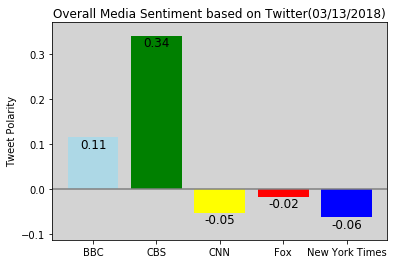

```python
import tweepy
import json
import pandas as pd
import numpy as np
import matplotlib.pyplot as plt
import time
from config import (consumer_key, 
                    consumer_secret, 
                    access_token, 
                    access_token_secret)
from vaderSentiment.vaderSentiment import SentimentIntensityAnalyzer
analyzer = SentimentIntensityAnalyzer()

auth = tweepy.OAuthHandler(consumer_key, consumer_secret)
auth.set_access_token(access_token, access_token_secret)
api = tweepy.API(auth, parser=tweepy.parsers.JSONParser())

from pprint import pprint
```


```python
target_users = ["@BBC","@CBS","@CNN","@FoxNews","@nytimes"]
sentiments = []

for user in target_users:
    public_tweets = api.user_timeline(user,count = 100)
    counter = 1
    for tweet in public_tweets:
        raw_times=(tweet["created_at"])
        text = tweet["text"]
        results = analyzer.polarity_scores(text)
        comp=results["compound"]
        neg=results["neg"]
        pos=results["pos"]
        neu=results["neu"]
        
        
        sentiments.append({"Name":user,
                           "Time":raw_times,
                           "Tweet":text,
                           "Compound Score":comp,
                           "Positive Score":pos,
                           "Negative Score":neg,
                           "Neutral Score":neu,
                          "Tweets Ago":counter})
        counter+=1
        
        

```


```python
df = pd.DataFrame.from_dict(sentiments)
df = df[["Tweets Ago","Name","Time","Tweet","Compound Score","Positive Score","Negative Score","Neutral Score"]]
df.to_csv("News Mood Sentiments.csv",index = False)
df.head()
```


<div>
<style>
    .dataframe thead tr:only-child th {
        text-align: right;
    }

    .dataframe thead th {
        text-align: left;
    }

    .dataframe tbody tr th {
        vertical-align: top;
    }
</style>
<table border="1" class="dataframe">
  <thead>
    <tr style="text-align: right;">
      <th></th>
      <th>Tweets Ago</th>
      <th>Name</th>
      <th>Time</th>
      <th>Tweet</th>
      <th>Compound Score</th>
      <th>Positive Score</th>
      <th>Negative Score</th>
      <th>Neutral Score</th>
    </tr>
  </thead>
  <tbody>
    <tr>
      <th>0</th>
      <td>1</td>
      <td>@BBC</td>
      <td>Tue Mar 13 18:30:05 +0000 2018</td>
      <td>Microplastics are littering riverbeds across t...</td>
      <td>0.0000</td>
      <td>0.000</td>
      <td>0.000</td>
      <td>1.000</td>
    </tr>
    <tr>
      <th>1</th>
      <td>2</td>
      <td>@BBC</td>
      <td>Tue Mar 13 17:30:06 +0000 2018</td>
      <td>❤️💃🏻 Ballet is STILL the love of Joyce's life ...</td>
      <td>0.6696</td>
      <td>0.290</td>
      <td>0.000</td>
      <td>0.710</td>
    </tr>
    <tr>
      <th>2</th>
      <td>3</td>
      <td>@BBC</td>
      <td>Tue Mar 13 17:16:46 +0000 2018</td>
      <td>RT @bbcthree: "No one needs airbags because yo...</td>
      <td>-0.2960</td>
      <td>0.000</td>
      <td>0.087</td>
      <td>0.913</td>
    </tr>
    <tr>
      <th>3</th>
      <td>4</td>
      <td>@BBC</td>
      <td>Tue Mar 13 17:13:13 +0000 2018</td>
      <td>RT @BBCR1: Now we have a trailer for #Fantasti...</td>
      <td>0.3182</td>
      <td>0.103</td>
      <td>0.000</td>
      <td>0.897</td>
    </tr>
    <tr>
      <th>4</th>
      <td>5</td>
      <td>@BBC</td>
      <td>Tue Mar 13 17:02:28 +0000 2018</td>
      <td>RT @bbcwritersroom: #Networking, a necessary e...</td>
      <td>-0.5255</td>
      <td>0.092</td>
      <td>0.188</td>
      <td>0.720</td>
    </tr>
  </tbody>
</table>
</div>


```python
BBC = df[df["Name"]=="@BBC"]
CBS = df[df["Name"] == "@CBS"]
CNN = df[df["Name"]=="@CNN"]
Fox = df[df["Name"]=="@FoxNews"]
NYT = df[df["Name"]=="@nytimes"]
plt.scatter(BBC["Tweets Ago"],
            BBC["Compound Score"],marker = "o",
            facecolors = "lightblue",
            edgecolor ="black",s = 100,
            label = "BBC")
plt.scatter(CBS["Tweets Ago"],
            CBS["Compound Score"],marker = "o",
            facecolors = "green",
            edgecolor ="black",
            s = 100,
            label = "CBS")
plt.scatter(CNN["Tweets Ago"],
            CNN["Compound Score"],marker = "o",
            facecolors = "red",
            edgecolor ="black",
            s = 100,
            label = "CNN")
plt.scatter(Fox["Tweets Ago"],
            Fox["Compound Score"],marker = "o",
            facecolors = "blue",
            edgecolor ="black",
            s = 100,
            label = "Fox")
plt.scatter(NYT["Tweets Ago"],
            NYT["Compound Score"],marker = "o",
            facecolors = "yellow",
            edgecolor ="black",s = 100,
            label = "New York Times")
legend = plt.legend(loc = "upper left", bbox_to_anchor=(1.04, 1),title = "Media Source")
plt.grid(True, color = "white")
plt.rcParams['axes.facecolor'] = 'lightgrey'
plt.title("Sentiment Analysis of Media Tweets (%s)" % (time.strftime("%m/%d/%Y")))
plt.xlabel("Tweets Ago")
plt.ylabel("Tweet Polarity")
plt.xlim(105,-5,-1)
plt.ylim(-1.2,1.2)
plt.show()
```


```python
x_axis = np.arange(len(target_users))
avg = df.groupby("Name")['Compound Score'].mean()
labels = ["BBC","CBS","CNN","Fox","New York Times"]
colors= ["lightblue","green", "yellow", "red", "blue"]
plt.bar(x_axis,avg,tick_label = labels, color = colors)
plt.axhline(y=0, color = 'grey')
for a,b in zip(x_axis,avg):
    plt.text(a, b-0.03, '%.2f' % b, ha='center', va= 'bottom',fontsize=12)
plt.title("Overall Media Sentiment based on Twitter(%s)"% (time.strftime("%m/%d/%Y")))
plt.ylabel("Tweet Polarity")
plt.ylim(min(avg)-0.05,max(avg)+0.03)
plt.show()


```




